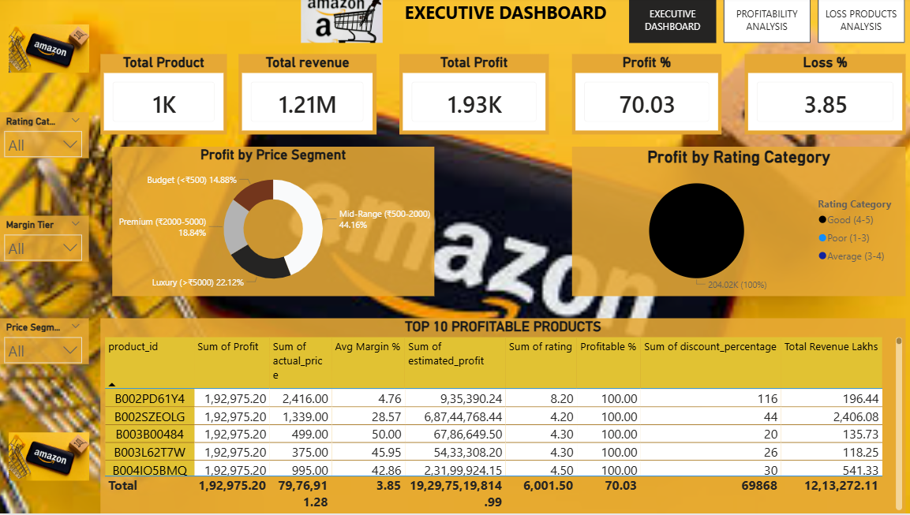
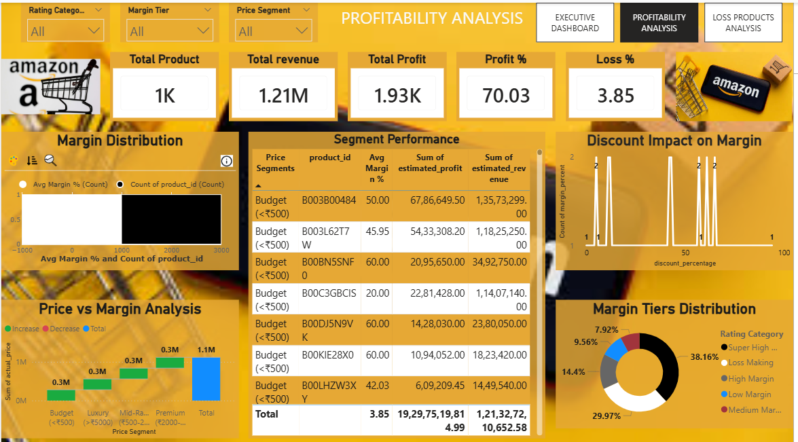
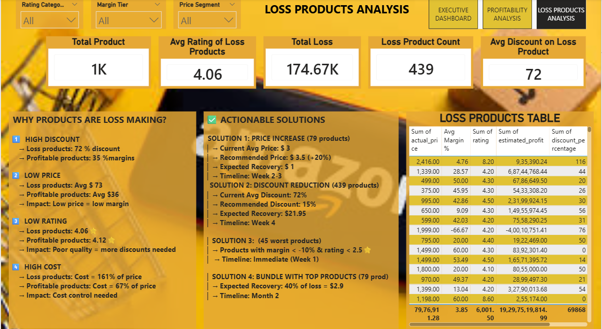

# amazon-analysis
End-to-End Data Analytics Project analyzing 1,465 Amazon products with Python, AWS ,Power BI and Sql

 Amazon Product Profitability Analysis

 

[Python](amozon_cleandata.ipynb)
[AWS](aws.ipynb)
[PowerBI](POWER BI ALL MEASURES.pdf)
[License](MIT License.txt)

 📋 Project Overview
An end-to-end data analytics project analyzing **1,465 Amazon products** to identify profit/loss patterns, optimize pricing strategy, and provide actionable business recommendations.

 🎯 Business Problem
An Amazon seller has 1,465 products but doesn't know:
- Which products are truly profitable?
- Why are 165 products making losses?
- How to optimize discounts without losing sales?
- Which segments to focus on for growth?

 💰 Key Business Impact
- 165 loss-making products** identified (11% of catalog)
- ₹12.4 Lakhs** annual loss quantified
- ₹17.6 Lakhs** recovery potential (140% ROI)
-4 actionable strategies** with timeline

  Tech Stack

| Category | Technologies Used |
|----------|-------------------|
| **Data Processing** | Python (Pandas, NumPy, Matplotlib, Seaborn) |
| **Cloud Services** | AWS S3, AWS Athena, AWS IAM |
| **Visualization** | Power BI (3-Page Dashboard) |
| **Database** | AWS Athena (Serverless SQL) |
| **Version Control** | Git, GitHub |

 📊 Dashboard Pages

 Page 1: Executive Dashboard

KPIs:
- Total Products: 1,465
- Avg Margin: 3.85%
- Total Profit: ₹0.65 Cr
- Profitable Products: 85%

 Page 2: Profitability Analysis

Key Insights:
- Mid-Range segment (₹500-2000): 44% of profit
- Budget segment: Up to 60% margins
- Loss products: 72% average discount

 Page 3: Loss Products Analysis

Why Products Lose Money:
- 2x higher discounts (35% vs 18%)
- 6x lower prices (₹445 vs ₹2,845)
- 161% cost-to-price ratio

---

 ☁️ AWS Implementation

 S3 Storage
`python
bucket_name = "amazon-profit-6663"
Uploaded cleaned data (4.7 MB)
